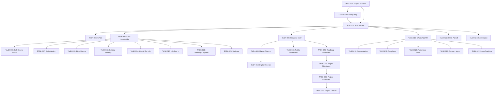

# 🕌 MMS — GitHub Issues Master Index

> **How to use:** Each file below is a self-contained GitHub Issue. Create them in order of priority. Labels, assignee placeholders, and dependencies are included. Copy-paste each file's content into a new GitHub Issue.

## Priority Legend

| Priority | Meaning | Label |
|---|---|---|
| 🔴 P0 | **Must have first** — Blocks everything else | `priority: critical` |
| 🟠 P1 | **Core feature** — Essential for MVP launch | `priority: high` |
| 🟡 P2 | **Important** — Needed before public release | `priority: medium` |
| 🟢 P3 | **Nice to have** — Can ship after initial launch | `priority: low` |

---

## 🔴 P0 — Foundation (Sprint 1-2)

_These must be completed first. Every other epic depends on them._

| # | Issue File | Epic | Est. |
|---|---|---|---|
| 1 | [TASK-001](./TASK-001-project-skeleton.md) | Multi-Tenant Infra | 3d |
| 2 | [TASK-002](./TASK-002-database-templating.md) | Multi-Tenant Infra | 3d |
| 3 | [TASK-003](./TASK-003-auth-rbac.md) | Multi-Tenant Infra | 5d |
| 4 | [TASK-004](./TASK-004-cicd-pipeline.md) | Multi-Tenant Infra | 2d |

---

## 🟠 P1 — Core MVP (Sprint 3-5)

_Core modules that make the system usable for a single mosque._

| # | Issue File | Epic | Est. |
|---|---|---|---|
| 5 | [TASK-005](./TASK-005-crm-dynamic-households.md) | CRM & Household | 5d |
| 6 | [TASK-006](./TASK-006-self-service-portal.md) | CRM & Household | 5d |
| 7 | [TASK-007](./TASK-007-data-deduplication.md) | CRM & Household | 3d |
| 8 | [TASK-008](./TASK-008-manual-entry-dashboard.md) | Shariah Financials | 5d |
| 9 | [TASK-009](./TASK-009-maker-checker-workflow.md) | Shariah Financials | 3d |
| 10 | [TASK-010](./TASK-010-digital-receipts.md) | Shariah Financials | 3d |
| 11 | [TASK-011](./TASK-011-public-financial-dashboard.md) | Shariah Financials | 3d |

---

## 🟡 P2 — Operations & Communication (Sprint 6-8)

_Operational tools and communication channels._

| # | Issue File | Epic | Est. |
|---|---|---|---|
| 12 | [TASK-012](./TASK-012-fixed-asset-management.md) | Mosque Operations | 5d |
| 13 | [TASK-013](./TASK-013-building-tenancy.md) | Mosque Operations | 5d |
| 14 | [TASK-014](./TASK-014-utensil-rentals.md) | Mosque Operations | 3d |
| 15 | [TASK-015](./TASK-015-life-events-registry.md) | Mosque Operations | 5d |
| 16 | [TASK-016](./TASK-016-meeting-dispute-management.md) | Mosque Operations | 3d |
| 17 | [TASK-017](./TASK-017-whatsapp-api-infra.md) | WhatsApp Hub | 5d |
| 18 | [TASK-018](./TASK-018-audience-segmentation.md) | WhatsApp Hub | 5d |
| 19 | [TASK-019](./TASK-019-template-management.md) | WhatsApp Hub | 3d |
| 20 | [TASK-020](./TASK-020-automated-workflows.md) | WhatsApp Hub | 5d |
| 21 | [TASK-021](./TASK-021-consent-management.md) | WhatsApp Hub | 2d |
| 22 | [TASK-022](./TASK-022-shared-inbox-analytics.md) | WhatsApp Hub | 5d |

---

## 🟢 P3 — Advanced Features (Sprint 9-12)

_Advanced modules that enhance the platform._

| # | Issue File | Epic | Est. |
|---|---|---|---|
| 23 | [TASK-023](./TASK-023-hr-payroll-engine.md) | HR & Governance | 5d |
| 24 | [TASK-024](./TASK-024-governance-elections.md) | HR & Governance | 5d |
| 25 | [TASK-025](./TASK-025-madrasa-management.md) | HR & Governance | 5d |
| 26 | [TASK-026](./TASK-026-roadmap-dashboard.md) | Strategic Roadmap | 5d |
| 27 | [TASK-027](./TASK-027-project-milestone-tracking.md) | Strategic Roadmap | 5d |
| 28 | [TASK-028](./TASK-028-project-financial-tracking.md) | Strategic Roadmap | 3d |
| 29 | [TASK-029](./TASK-029-project-completion-workflow.md) | Strategic Roadmap | 2d |

---

## Dependency Graph

